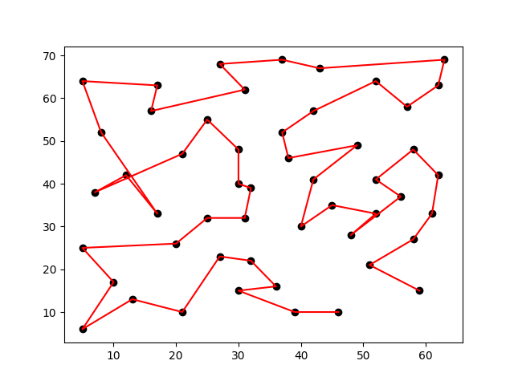

# TSP-using-mst-and-2-opt

The program is to generate a solution for traveling sales person using Minimum Spanning Tree (MST) and 2-Opt heuristics method. The input of the program are eil51.tsp, eil76.tsp and eil101.tsp. These files are taken from http://elib.zib.de/pub/mp-testdata/tsp/tsplib/tsp/.

## Dependencies
* matplotlib
* numpy

## Run instruction
* Run the main.py
* Press 1, 2 or 3 to choose the input file for the program

Output generated is <input_file_name>.out.tour. For visualization purposes a image file also generated with the name <input_file_name>\_final.png

## Output
### Output before 2-opt:

### Final output:

